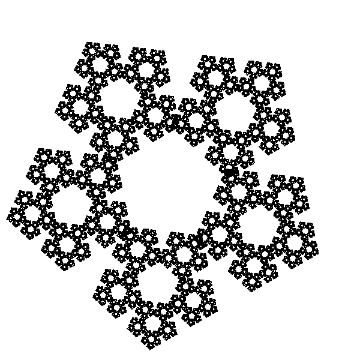
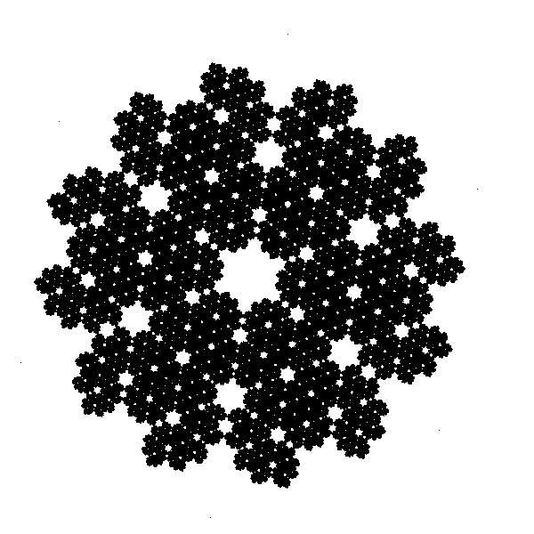

# ChaosGamePlot

Plot fractals using the chaos game method and C++.
This package use 4 set of rules for the chaos game.

# Installation

```R
# install.packages("devtools")
devtools::install_github("cesandovalp/ChaosGamePlot")
```

# Example

## Code

```R
library(ChaosGamePlot)
result = RunChaosGame(5, .4, 100**3, 1)
```
## Output



## Code

```R
library(ChaosGamePlot)
result = ChaosGamePlot::RunChaosGame(6, .5, 100**4, 3)
```
## Output


