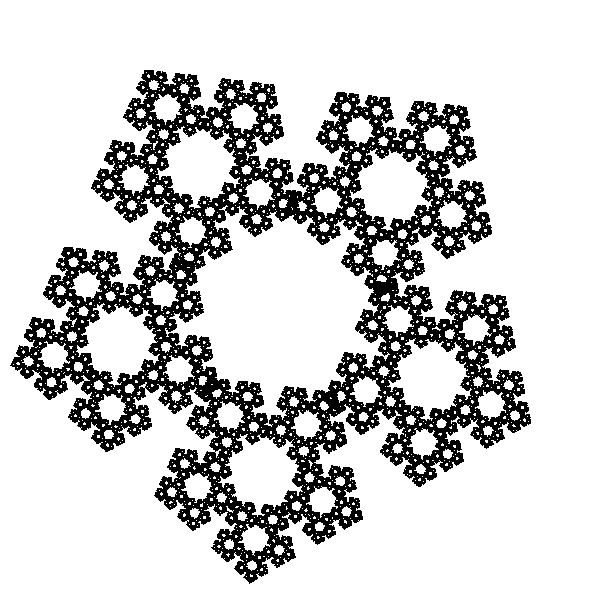

# ChaosGamePlot

Plot fractals using the chaos game method and C++.
This package use only one rule for the chaos game.

# Installation

```R
# install.packages("devtools")
devtools::install_github("cesandovalp/ChaosGamePlot")
```

# Example

```R
library(ChaosGamePlot)
result = RunChaosGame(5, .4, 100**3)
```
## Output


